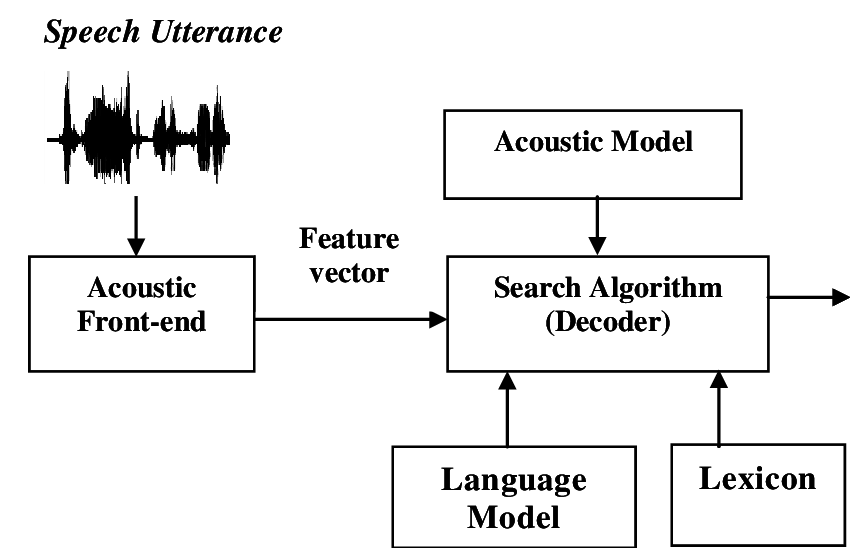

# Auditory EEG Decoding Challenge 

This is the Repo for the Submission of Electronics Club for the ICASSP 2024 Auditory Decoding Challenge 

## About the Challenge

The ICASSP 2024 Auditory EEG Decoding Challenge is a cutting-edge competition focused on bridging the gap between auditory perception and brain activity analysis. Key aspects of this challenge include:

### Objective
The primary goal is to develop advanced algorithms capable of decoding auditory information from electroencephalography (EEG) data. Participants are tasked with creating models that can accurately predict auditory stimuli based on recorded brain activity.

### Dataset
Competitors are provided with a comprehensive dataset containing:
- EEG recordings from multiple subjects
- Corresponding auditory stimuli information
- Metadata on experimental conditions and subject details

### Challenge Format
- The competition is divided into multiple phases, including training, validation, and final testing.
- Participants are required to submit their models for evaluation on a held-out test set.
- Performance is assessed using metrics such as decoding accuracy, correlation between predicted and actual stimuli, and generalization across subjects.

### Significance
This challenge addresses crucial aspects of cognitive neuroscience and has potential applications in:
- Developing advanced brain-computer interfaces
- Enhancing hearing aid technologies
- Furthering our understanding of auditory processing in the brain
- Exploring new methodologies for non-invasive brain signal analysis

### Timeline
- Challenge Announcement: [August 30,2023]
- Dataset Release: [November 28, 2023]
- Submission Deadline: [December 28, 2023]
By participating in this challenge, our team aims to contribute to the cutting-edge research in auditory neuroscience and push the boundaries of EEG signal processing techniques.

## Our Approach 
We tried through 2 Possible Approaches 
### Resnet + Cosine Similarity 
We used Resnet as a feature extractor and then used Cosine Similarity to find the similarity between them. 

### SpeechFFR+Attention
We used SpeechFFR as a feature extractor and then used Attention to find the similarity between them.

